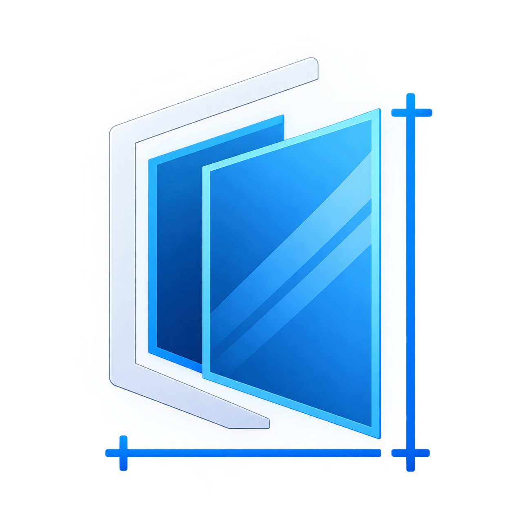
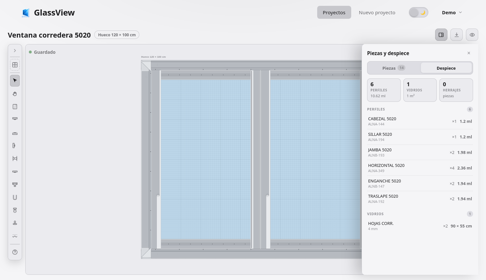
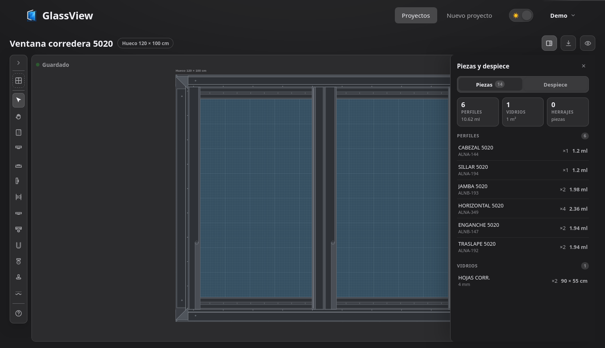

<p align="center">
  
</p>

<h1 align="center">GlassView</h1>

<p align="center">
  <strong>Planos y despiece de instalaciones de cristalería</strong><br />
  Dibuja la ventana a escala real y obtén el despiece: perfiles, vidrio, herrajes y empaques.
</p>

<p align="center">
  
  
  
  
  
  
  
</p>

---

GlassView es una aplicación web para dibujar planos de instalaciones de cristalería y sacar de ahí el despiece de la obra: cuántos metros lineales de cada perfil, cuántos metros cuadrados de vidrio y qué herrajes y empaques se necesitan. El catálogo de modelos y las fórmulas de corte salen de un Excel real de ventanería (`descuentos de ventaneria.xlsx`), no de medidas inventadas.

El proyecto está en desarrollo activo. El dibujo, las plantillas, el despiece y el PDF funcionan de punta a punta; el cobro de la suscripción todavía es simulado y los precios del despiece aún no se muestran en la interfaz.

## Capturas

| Tema claro | Tema oscuro |
|---|---|
|  |  |

## Funcionalidad

Cada cuenta arranca con una prueba gratuita de `TRIAL_DAYS` días (10 por defecto). Durante la prueba, o con la suscripción activa, se puede usar todo:

- **Editor de planos a escala real** (todo en centímetros) con rejilla, zoom, desplazamiento, pantalla completa y modo vista. Si el proyecto tiene un *hueco de obra*, el área dibujable se limita a ese vano y las piezas no pueden salirse de él; si no, el lienzo es un mapa libre.
- **Piezas con geometría propia**, no rectángulos genéricos: jambas, cabezales, sillares, enganches, traslapes, rieles, canales U, tubos, adaptadores y pisavidrios se dibujan como perfiles de aluminio con su cámara hueca, garganta de vidrio y detalles de cada tipo (gotero, peldaño, gancho, recibidor...). El vidrio, el acrílico, las rodachinas, manijas, seguros, empaques y felpas también tienen su forma. La misma geometría alimenta el lienzo Konva, las miniaturas de la lista de proyectos y el PDF.
- **Plantillas por modelo**: 22 modelos repartidos en 7 familias (5020, 744, 8025, 7038, 3831, P.B. y divisiones de baño) que colocan automáticamente el marco, las hojas, los rieles, los parales y los vidrios con las medidas de corte del catálogo.
- **Panel de piezas y despiece** con pestañas: la pestaña *Piezas* agrupa el plano en perfiles, vidrios y herrajes y permite seleccionar o eliminar cada pieza; la pestaña *Despiece* resume la obra y agrupa los cortes por REF con metros lineales, área de vidrio y conteo de herrajes.
- **Exportación a PDF** vectorial en A5, con las piezas dibujadas con su geometría real y cotas en centímetros en los cuatro lados.
- **Panel de administración** para listar, crear, bloquear y eliminar cuentas. El administrador no puede ver los proyectos de nadie: cada usuario solo accede a los suyos.

### Precio local

La suscripción cuesta `PRICE_USD` dólares al mes, pero se muestra convertida a la moneda del visitante. La detección del país prueba, en orden: el parámetro `?pais=`, las cabeceras geográficas del proxy (`cf-ipcountry`, `x-vercel-ip-country`), la geolocalización por IP y el idioma del navegador. Los tipos de cambio vienen de una API pública con caché de 12 horas y una tabla de respaldo local por si la API no responde. Las monedas sin decimales (COP, CLP, PYG, VES, JPY...) se redondean como se cobran en la práctica.

`POST /api/facturacion/pagar` simula el cobro, activa 30 días y guarda el comprobante con la referencia, el importe local y su equivalente en USD. Es el único punto que hay que tocar para conectar Stripe, MercadoPago o lo que sea.

## Stack

| Capa | Tecnología |
|---|---|
| Backend | Node.js, Express y TypeScript estricto |
| Base de datos | MongoDB (Atlas o local) con Mongoose |
| Sesión | Token firmado con HMAC + contraseñas con scrypt (`node:crypto`) |
| Divisas | `open.er-api.com` en vivo, con caché y respaldo local |
| Frontend | React 18, TypeScript y Vite |
| Lienzo | Konva.js (react-konva) |
| PDF | jsPDF, dibujo vectorial |
| Documentación de API | Swagger UI (OpenAPI 3.0) |

## Arquitectura

El backend separa rutas, controladores y servicios: la lógica de negocio vive en `services/` y los controladores solo orquestan. Todas las respuestas tienen la forma `{ exito, datos, mensaje }`, y los errores de sesión o de plan agregan un `codigo` (`NO_AUTENTICADO`, `SUSCRIPCION_REQUERIDA`, `PERMISOS_INSUFICIENTES`) que el frontend usa para reaccionar.

El frontend consume la API solo a través de `src/api/clienteApi.ts`; no conoce la base de datos. La sesión vive en `src/contextos/SesionContexto.tsx`.

La pieza central del frontend es `src/piezas/`. Cada pieza se describe una sola vez con primitivas abstractas (líneas, rectángulos, polígonos) en centímetros, y esas primitivas se pintan después en Konva, en SVG y en el PDF. Por eso una jamba se ve igual en el editor, en la miniatura de la lista y en el plano exportado. La identidad de cada pieza (qué clase visual es) se resuelve combinando su tipo, su REF y su descripción, y hay ganchos (`PARAMETROS_POR_REF`, `DEFINICIONES_POR_SISTEMA`) preparados para cuando existan las secciones comerciales exactas de cada sistema.

Los proyectos guardan una lista de piezas con su REF, posición y medidas. Todo es una pieza: un perfil, un vidrio, una rodachina o un empaque. Las plantillas solo son una forma cómoda de colocar muchas piezas de golpe. El orden de dibujo pone los vidrios detrás y los perfiles delante; dentro de eso, la última pieza seleccionada se dibuja encima para poder trabajar con piezas superpuestas.

## Estructura del repositorio

```
GlassView/
├── backend/
│   └── src/
│       ├── config/         # Lectura de variables de entorno
│       ├── controllers/    # Endpoints (auth, catálogo, facturación, proyectos)
│       ├── docs/           # Especificación OpenAPI
│       ├── middleware/     # autenticar, requiereSuscripcion, soloAdmin, errores
│       ├── models/         # Esquemas Mongoose (Usuario, Proyecto, Pieza)
│       ├── routes/         # Definición de rutas
│       └── services/
│           ├── catalogo/   # Modelos por familia y cálculo de despiece
│           ├── bootstrap.ts        # Cuenta admin inicial
│           ├── contrasenas.ts      # scrypt
│           ├── despiecePiezas.ts   # Despiece por piezas y plantillas
│           ├── divisas.ts          # Países, tasas y detección de país
│           ├── perfilesVentaneria.ts # Diccionario de REFs
│           ├── suscripcion.ts      # Prueba, suscripción y estado de acceso
│           └── token.ts            # Firma y verificación HMAC
├── frontend/
│   └── src/
│       ├── api/            # clienteApi.ts
│       ├── componentes/    # Lienzo Konva, panel de despiece, diálogos
│       ├── components/     # Navegación, editor, landing, piezas de UI
│       ├── contextos/      # Sesión
│       ├── estilos/        # CSS por zona (incluye el tema oscuro)
│       ├── hooks/          # useZoomPan, useRejilla, useTema
│       ├── pages/          # Inicio, Acceso, Registro, Proyectos, editor...
│       ├── pdf/            # Exportación del plano
│       ├── piezas/         # Motor de geometría paramétrica
│       └── utils/          # Geometría, colores, formato, país
├── docs/                   # Capturas para este README
├── LICENSE
└── README.md
```

### Convenciones

- Nombres en español: camelCase para funciones y variables, PascalCase para tipos y componentes, kebab-case para el CSS. Sin mezclar idiomas dentro de un identificador.
- Los comentarios van solo donde hacen falta: lógica complicada, decisiones no obvias, unidades. No se comenta lo que ya dice el nombre.
- TypeScript estricto en los dos paquetes. Antes de dar por cerrado un cambio, compilan backend y frontend.

## Puesta en marcha

Requisitos: Node.js 20 o superior y una instancia de MongoDB (Atlas o local).

```bash
# Backend
cd backend
npm install
cp .env.example .env   # ajustar al menos MONGO_URI y SECRET_TOKEN

# Frontend
cd ../frontend
npm install
# el proxy de Vite manda /api al backend en desarrollo, no hace falta .env
```

### Variables de entorno

Backend (`.env`):

| Variable | Descripción |
|---|---|
| `MONGO_URI` | Cadena de conexión a MongoDB |
| `PORT` | Puerto del servidor (4000 por defecto) |
| `SECRET_TOKEN` | Clave para firmar los tokens de sesión. Cambiarla siempre en producción |
| `TRIAL_DAYS` | Días de prueba por cuenta (10 por defecto) |
| `PRICE_USD` | Precio mensual de la suscripción en dólares |
| `ADMIN_EMAIL` / `ADMIN_PASSWORD` | Cuenta admin que se crea al arrancar, si se define |
| `ALLOWED_ORIGINS` | Orígenes permitidos por CORS, separados por comas |

Frontend, solo en producción:

| Variable | Descripción |
|---|---|
| `VITE_API_URL` | URL base del backend, sin `/api` al final |

### Desarrollo

```bash
cd backend && npm run dev      # API con recarga automática en :4000
cd frontend && npm run dev     # interfaz en :5173
```

## Scripts

| Carpeta | Comando | Qué hace |
|---|---|---|
| backend | `npm run dev` | API con recarga automática |
| backend | `npm run build` | Compila TypeScript a `dist/` |
| backend | `npm start` | Corre la API compilada |
| frontend | `npm run dev` | Servidor de desarrollo |
| frontend | `npm run build` | Chequeo de tipos y empaquetado de producción |

## API

La documentación interactiva está en `http://localhost:4000/api/docs`. Las rutas protegidas piden la cabecera `x-token-acceso` con el token que devuelven el registro o el login.

| Método y ruta | Descripción |
|---|---|
| `GET /api/estado` | Health check (público) |
| `POST /api/auth/registro` · `POST /api/auth/login` | Crear cuenta / iniciar sesión (públicos) |
| `GET` · `PUT /api/auth/perfil` | Leer / actualizar el perfil |
| `PUT /api/auth/contrasena` · `DELETE /api/auth/cuenta` | Cambiar contraseña / borrar la cuenta |
| `GET /api/facturacion/precio` | Precio mensual en la moneda del visitante (público) |
| `GET /api/facturacion` · `POST /api/facturacion/pagar` | Estado de facturación / pago simulado |
| `GET` · `POST /api/auth/usuarios` | (Admin) Listar / crear cuentas |
| `GET` · `PUT` · `DELETE /api/auth/usuarios/:id` | (Admin) Gestionar una cuenta |
| `GET /api/catalogo-ventaneria` · `/perfiles` | Modelos y diccionario de REFs |
| `POST /api/catalogo-ventaneria/despiece` · `/despiece-piezas` | Despiece por modelo / por piezas dibujadas |
| `POST /api/catalogo-ventaneria/preset` | Piezas de una plantilla |
| `GET` · `POST /api/proyectos` | Listar / crear proyectos propios |
| `GET` · `PUT` · `DELETE /api/proyectos/:id` | Gestionar un proyecto propio |

## Catálogo de ventanería

Vive en `backend/src/services/catalogo/`. Cada familia tiene su archivo `modelos*.ts` con los modelos (REFs de perfiles, fórmulas de medida, vidrios y accesorios), y `catalogo.ts` los une en el orden del Excel. Los helpers de `tipos.ts` (`a`, `h`, `f`, `p`, `v`) sirven para declarar las fórmulas de corte de forma corta; en los comentarios de ese archivo está explicado el formato.

Para agregar un modelo:

1. Declararlo en el `modelos*.ts` de su familia.
2. Añadir las REFs nuevas a `backend/src/services/perfilesVentaneria.ts` para que el despiece las consolide.
3. Probar con `POST /api/catalogo-ventaneria/despiece` desde Swagger.

## Pruebas y verificación

No hay suite automatizada todavía. Lo que se hace hoy:

- `npm run build` en ambos paquetes (TypeScript estricto) como chequeo mínimo antes de cerrar un cambio.
- Probar los endpoints desde Swagger UI o con `curl`.
- Para el plan: registrar una cuenta, vencer la prueba desde el panel admin y comprobar el `402`, pagar y verificar que se reactiva.

Si se agregan tests, los sitios previstos son `backend/test/` (node:test) y `frontend/src/**/*.test.tsx` (vitest + testing-library).

## Despliegue

El frontend está publicado en Vercel (`https://glass-view.vercel.app`); en producción hay que configurar `VITE_API_URL` con la URL del backend. El backend es un servicio Node normal que expone `/api` y necesita `MONGO_URI`, `SECRET_TOKEN`, `TRIAL_DAYS`, `PRICE_USD`, `ADMIN_EMAIL`, `ADMIN_PASSWORD` y `ALLOWED_ORIGINS`. Detrás de un proxy con cabeceras geográficas (Cloudflare, Vercel, Nginx) la detección de país funciona mejor; si no, cae a la IP y al idioma.

## Licencia

GlassView pertenece a IntoCode y se distribuye bajo una licencia comercial propia (ver [LICENSE](LICENSE)): se puede leer y estudiar el código, pero está prohibido copiar la funcionalidad o usarla comercialmente sin una licencia de IntoCode.

© 2026 IntoCode — Desarrollado por Axl Anzola y Dilan Acuña.
