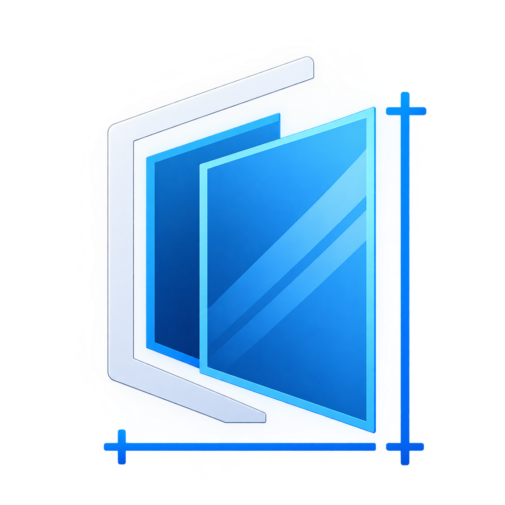

<p align="center">
  
</p>

<h1 align="center">GlassView</h1>

<p align="center">
  <strong>Planos y despiece de instalaciones de cristalería</strong><br />
  Dibuja la ventana a escala real y obtén el despiece: perfiles, vidrio, herrajes y empaques.
</p>

<p align="center">
  
  
  
  
  
  
  
</p>

---

GlassView es una aplicación web —instalable como PWA— para dibujar planos de instalaciones de cristalería y sacar el despiece de la obra: cuántos metros lineales de cada perfil, cuántos metros cuadrados de vidrio y qué herrajes y empaques se necesitan.

Está pensada para talleres y vidrierías: en lugar de dibujar la ventana en un programa de CAD genérico y calcular los cortes a mano, todo el proceso —medidas, dibujo, despiece y PDF para la obra— vive en la misma herramienta.

> **Estado:** en desarrollo activo. El dibujo, las plantillas, el despiece y el PDF funcionan de punta a punta; el cobro de la suscripción todavía es simulado y los precios del despiece aún no se muestran en la interfaz.

## Índice

- [Cómo funciona](#cómo-funciona)
- [Funcionalidad](#funcionalidad)
- [Stack](#stack)
- [Arquitectura](#arquitectura)
- [Estructura del repositorio](#estructura-del-repositorio)
- [Convenciones](#convenciones)
- [Puesta en marcha](#puesta-en-marcha)
- [Scripts](#scripts)
- [API](#api)
- [Catálogo de ventanería](#catálogo-de-ventanería)
- [Pruebas y verificación](#pruebas-y-verificación)
- [Despliegue](#despliegue)
- [Licencia](#licencia)

## Cómo funciona

1. **Crea la cuenta.** El registro es gratis y sin tarjeta; cada cuenta nueva arranca con una prueba de `TRIAL_DAYS` días (10 por defecto).
2. **Crea el proyecto.** Le pones nombre y cliente, defines el *hueco de obra* (las medidas reales del vano) o un *mapa libre* y, si quieres, partes de una plantilla de ventanería que coloca el marco, las hojas y los vidrios de una vez.
3. **Dibuja y ajusta.** En el editor a escala real colocas cada pieza (perfiles, vidrio, herrajes y empaques) con las herramientas del catálogo, con plantillas o con tus propias piezas personalizadas; mueves, mides y corriges hasta que la ventana quede como la necesitas.
4. **Revisa el despiece.** El panel lateral convierte el plano en la lista de material: cortes por REF con metros lineales, área de vidrio y conteo de herrajes y empaques.
5. **Exporta.** Descargas un PDF A4 con el plano acotado, el detalle por pieza y el despiece por grupos de taller, listo para presupuestar o para llevar al taller.

## Funcionalidad

Cada cuenta arranca con una prueba gratuita de `TRIAL_DAYS` días (10 por defecto). Durante la prueba, o con la suscripción activa, se puede usar todo.

### Cuenta y acceso

- **Registro e inicio de sesión** con correo y contraseña. La sesión se guarda con un token firmado con HMAC y las contraseñas con `scrypt` (`node:crypto`).
- **Prueba y suscripción**: cada cuenta arranca con una prueba gratuita; al vencer, el backend responde `402` y el frontend redirige a la pantalla de facturación. La suscripción se activa por 30 días.
- **Perfil** en tarjetas: datos de la cuenta, estado del plan con su progreso, datos personales, cambio de contraseña y eliminación de la cuenta (con confirmación escribiendo el correo).
- **Facturación**: plan actual, fecha de renovación, compra del plan y listado de facturas con su referencia, importe local y equivalente en dólares.
- **Precio local**: la suscripción cuesta `PRICE_USD` dólares al mes, pero se muestra convertida a la moneda del visitante. La detección del país prueba, en orden: el parámetro `?pais=`, las cabeceras geográficas del proxy (`cf-ipcountry`, `x-vercel-ip-country`), la geolocalización por IP y el idioma del navegador. Los tipos de cambio vienen de una API pública con caché de 12 horas y una tabla de respaldo local; las monedas sin decimales (COP, CLP, PYG, VES, JPY…) se redondean como se cobran en la práctica.
- **Pago simulado**: `POST /api/facturacion/pagar` simula el cobro, activa 30 días y guarda el comprobante. Es el único punto que hay que tocar para conectar Stripe, MercadoPago o lo que sea.
- **Administración**: panel para listar, crear, bloquear y eliminar cuentas. El administrador no puede ver los proyectos de nadie: cada usuario solo accede a los suyos.
- **Página pública de inicio** con la propuesta, las características, los tres pasos del flujo y el precio en la moneda del visitante.

### Proyectos

- **Biblioteca de planos** por cuenta: cada proyecto se muestra en una tarjeta con su miniatura (el plano dibujado de verdad), el cliente, la fecha y chips con el resumen del material (piezas, perfiles, vidrios, metros lineales y m² de vidrio). La tarjeta más reciente aparece destacada.
- **Privacidad**: los proyectos solo son visibles para su propietario; ni el administrador puede verlos.
- **Nuevo proyecto** con asistente: nombre y cliente, **hueco de obra** (medidas reales del vano) o **mapa libre** (lienzo infinito), plantilla opcional y **vista previa en vivo** que refleja las medidas y la plantilla elegidas antes de crear.
- **Abrir, editar y eliminar** proyectos. El editor se abre en modo vista (solo lectura) y se pasa a edición con un botón; eliminar un proyecto pide confirmación y borra también sus piezas.

### Editor de planos

- **A escala real, en centímetros**, con rejilla y **reglas de centímetros** en los bordes superior e izquierdo que se recalculan con el zoom y el desplazamiento.
- **Encuadre automático**: al abrir, la vista se ajusta al hueco o al contenido y sigue reajustándose hasta que el usuario mueve o hace zoom.
- **Hueco de obra o mapa libre**: con hueco, el área dibujable se limita a esas medidas y las piezas no pueden salirse; sin hueco, el lienzo es infinito.
- **Herramientas de dibujo** por tipo de pieza: seleccionar, desplazar el plano, vidrio, cabezal, sillar, jamba, enganche/traslape, horizontal, riel, canal U, rodachina, manija y empaque/felpa. Se dibujan arrastrando sobre el lienzo y cada pieza se crea con su geometría real.
- **Plantillas por modelo**: 22 modelos repartidos en 7 familias (5020, 744, 8025, 7038, 3831, P.B. y divisiones de baño) que colocan automáticamente el marco, las hojas, los rieles, los parales y los vidrios con las medidas de corte del catálogo.
- **Piezas personalizadas** propias o públicas, también desde la barra de herramientas.
- **Piezas con geometría propia**, no rectángulos genéricos: jambas, cabezales, sillares, enganches, traslapes, rieles, canales U, tubos, adaptadores y pisavidrios se dibujan como perfiles de aluminio con su cámara hueca, garganta de vidrio y detalles de cada tipo (gotero, peldaño, gancho, recibidor…). El vidrio, el acrílico, las rodachinas, manijas, seguros, empaques y felpas también tienen su forma.
- **Selección y medidas**: al tocar una pieza se selecciona, se muestra su ficha (tipo, REF, medidas y sección) y sus cotas; se puede mover y redimensionar con las asas.
- **Deshacer** con Ctrl+Z o el icono del encabezado.
- **Zoom y desplazamiento**: rueda del ratón, botones, pinza táctil para acercar o alejar y arrastre (o dos dedos) para desplazar la vista; botón para encuadrar todo.
- **Guardado automático**: cada gesto se sincroniza con el servidor y el estado se muestra en el lienzo (guardado, guardando o error).
- **Pantalla completa** y **modo vista** (solo lectura, con descarga del PDF).
- **Gestos táctiles**: pellizcar para acercar o alejar, arrastrar con la mano para desplazar y tocar o arrastrar piezas y vértices para moverlos.

### Despiece y exportación

- **Panel de piezas y despiece** con pestañas: *Piezas* agrupa el plano en perfiles, vidrios y herrajes y permite seleccionar o eliminar cada pieza; *Despiece* resume la obra y agrupa los cortes por REF con metros lineales, área de vidrio y conteo de herrajes.
- **PDF vectorial en A4**: la primera página trae el plano con su geometría real, cotas por tramos y totales en los cuatro lados y cada pieza numerada; después, la tabla de **detalle por pieza** (REF, descripción, medidas, espesor, cantidad y posición) y el **despiece por grupos de taller** (MARCO, HOJAS, OTROS PERFILES, EMPAQUE, VIDRIOS y HERRAJES) con las medidas de corte, las cantidades y los metros lineales o metros cuadrados.
- La misma geometría alimenta el lienzo Konva, las miniaturas de la lista de proyectos y el PDF.

### Piezas personalizadas

- **Biblioteca por cuenta**: cada cuenta diseña sus propias piezas dibujando solo la forma sobre una rejilla; las medidas se definen al colocar la pieza en el plano.
- **Identificación**: nombre, REF y tipo (perfil, vidrio, acrílico o herraje); el tipo determina los campos disponibles (uso en perfiles y herrajes, espesor en vidrios y acrílicos).
- **Editor por capas**: barra de herramientas expandible (con nombres), panel de capas (renombrar, ocultar, reordenar, agregar y eliminar), guía de trazado, arrastre de vértices y de figuras completas, deshacer y rehacer (Ctrl+Z / Ctrl+Shift+Z) y una ayuda con las instrucciones.
- **Materiales**: al cerrar una figura se elige su material, que también se cambia por capa desde la tarjeta de la capa con su color; hay materiales de partida (aluminios, vidrios, acrílicos y herrajes) y materiales propios.
- **Comunidad**: un interruptor permite publicar la pieza y las públicas se exploran en una galería aparte.
- En pantallas pequeñas el editor se abre en pantalla completa y se dibuja en horizontal.

### Experiencia

- **Responsividad**: la interfaz se reorganiza en pantallas pequeñas (navegación compacta con menú desplegable —enlaces, tema y cuenta—, listas y paneles a una sola columna, tarjetas y tablas con desplazamiento). Los editores se usan en horizontal: en orientación vertical aparece un aviso con una vista previa de lo que se edita y un botón para activar la pantalla completa y bloquear el giro.
- **Tema claro y oscuro** con detección de la preferencia del sistema y conmutador propio.
- **Tutorial guiado**: se abre solo en el primer ingreso de una cuenta nueva. Las tarjetas se anclan y resaltan lo que explican, con tamaño adaptativo: recorre la pestaña y la página de proyectos, crea un proyecto de ejemplo con plantilla, enseña el lienzo y las herramientas del editor con su despiece y termina en las piezas personalizadas. Desde el icono de información del pie de página se elige entre cinco recorridos —Proyectos, Nuevo proyecto, Plano, Piezas o el completo—; el de Plano abre el proyecto más reciente y el de Proyectos resalta solo la tarjeta más reciente.
- **Aplicación instalable (PWA)**: manifiesto y service worker propios. Se instala en escritorio, Android e iOS, abre sin conexión con la aplicación precargada, incluye accesos directos a Proyectos, Nuevo proyecto y Piezas, y avisa cuando hay una versión nueva o cuando ya está lista para abrirse sin internet.
- **Diálogos propios**: las acciones destructivas (eliminar la cuenta, un proyecto o un usuario) se confirman con un modal de la app; para borrar la cuenta hay que escribir su correo.

## Stack

| Capa | Tecnología |
|---|---|
| Backend | Node.js, Express y TypeScript estricto |
| Base de datos | MongoDB (Atlas o local) con Mongoose |
| Sesión | Token firmado con HMAC + contraseñas con scrypt (`node:crypto`) |
| Divisas | `open.er-api.com` en vivo, con caché y respaldo local |
| Frontend | React 18, TypeScript y Vite |
| PWA | `vite-plugin-pwa` (Workbox): manifiesto, precarga y avisos |
| Lienzo | Konva.js (react-konva) |
| PDF | jsPDF, dibujo vectorial |
| Documentación de API | Swagger UI (OpenAPI 3.0) |

## Arquitectura

El backend separa rutas, controladores y servicios: la lógica de negocio vive en `services/` y los controladores solo orquestan. Todas las respuestas tienen la forma `{ exito, datos, mensaje }`, y los errores de sesión o de plan agregan un `codigo` (`NO_AUTENTICADO`, `SUSCRIPCION_REQUERIDA`, `PERMISOS_INSUFICIENTES`) que el frontend usa para reaccionar.

El frontend consume la API solo a través de `src/api/clienteApi.ts`; no conoce la base de datos. La sesión vive en `src/contextos/SesionContexto.tsx`. Las acciones destructivas se confirman con el diálogo propio que provee `useConfirmacion()` (`src/componentes/dialogos/`), en lugar de los `window.confirm` nativos.

La pieza central del frontend es `src/piezas/`. Cada pieza se describe una sola vez con primitivas abstractas (líneas, rectángulos, polígonos) en centímetros, y esas primitivas se pintan después en Konva, en SVG y en el PDF. Por eso una jamba se ve igual en el editor, en la miniatura de la lista y en el plano exportado. La identidad de cada pieza (qué clase visual es) se resuelve combinando su tipo, su REF y su descripción, y hay ganchos (`PARAMETROS_POR_REF`, `DEFINICIONES_POR_SISTEMA`) preparados para cuando existan las secciones comerciales exactas de cada sistema.

Los proyectos guardan una lista de piezas con su REF, posición y medidas. Todo es una pieza: un perfil, un vidrio, una rodachina o un empaque. Las plantillas solo son una forma cómoda de colocar muchas piezas de golpe. El orden de dibujo pone los vidrios detrás y los perfiles delante; dentro de eso, la última pieza seleccionada se dibuja encima para poder trabajar con piezas superpuestas.

## Estructura del repositorio

```
GlassView/
├── backend/
│   └── src/
│       ├── config/         # Lectura de variables de entorno
│       ├── controllers/    # Endpoints (auth, catálogo, facturación, proyectos, piezas)
│       ├── docs/           # Especificación OpenAPI
│       ├── middleware/     # autenticar, requiereSuscripcion, soloAdmin, errores
│       ├── models/         # Esquemas Mongoose (Usuario, Proyecto, Pieza, PiezaPersonalizada)
│       ├── routes/         # Definición de rutas
│       └── services/
│           ├── auth/       # contrasenas (scrypt), token (HMAC), bootstrap (admin inicial)
│           ├── catalogo/   # Fachada, modelos por familia, despiece y diccionario de REFs
│           ├── facturacion/# suscripcion y divisas (precio local)
│           └── infra/      # conexionMongo
├── frontend/
│   ├── public/             # Iconos de la app y de la PWA
│   └── src/
│       ├── api/            # Fachada clienteApi + módulos por dominio (http, auth, proyectos…)
│       ├── componentes/
│       │   ├── autenticacion/  # Layout de acceso/registro y campos
│       │   ├── comunes/        # Iconos, tema, avisos y fondo animado
│       │   ├── despiece/       # Panel de despiece
│       │   ├── dialogos/       # Confirmaciones propias
│       │   ├── editor/         # Contenedor del editor de planos
│       │   ├── estructura/     # Armazón de la app (navegación, contenido y pie)
│       │   ├── lienzo/         # Lienzo Konva, herramientas, cotas y reglas
│       │   ├── navegacion/     # Barra de navegación y pie de página
│       │   ├── piezas/         # Editor de formas y vistas de pieza
│       │   ├── pwa/            # Avisos de instalación y actualización
│       │   └── tutorial/       # Recorridos guiados
│       ├── contextos/      # Sesión
│       ├── estilos/        # CSS por zona (incluye el tema oscuro)
│       ├── hooks/          # useZoomPan, useRejilla, useTema, useEsMovil, useEditorCompleto
│       ├── pages/          # Inicio, Acceso, Proyectos, Piezas, Perfil, editores…
│       ├── pdf/            # Exportación del plano
│       ├── piezas/         # Motor de geometría paramétrica (sin React)
│       ├── tipos/          # Tipos compartidos (index.ts) y del lienzo (lienzo.ts)
│       └── utils/          # Geometría, colores, formato, país y pantalla completa
├── package.json            # Workspaces de npm (backend + frontend) y scripts raíz
├── LICENSE
└── README.md
```

### Convenciones

- Nombres en español: camelCase para funciones y variables, PascalCase para tipos y componentes, kebab-case para el CSS. Sin mezclar idiomas dentro de un identificador.
- Los comentarios van solo donde hacen falta: lógica complicada, decisiones no obvias, unidades. No se comenta lo que ya dice el nombre.
- TypeScript estricto en los dos paquetes. Antes de dar por cerrado un cambio, compilan backend y frontend.

## Puesta en marcha

Requisitos: Node.js 20 o superior y una instancia de MongoDB (Atlas o local).

El repositorio usa **workspaces de npm**: una sola instalación desde la raíz deja listos el backend y el frontend.

```bash
npm install                        # instala backend y frontend

cp backend/.env.example backend/.env   # ajustar al menos MONGO_URI y SECRET_TOKEN
# el proxy de Vite manda /api al backend en desarrollo, no hace falta .env en el frontend
```

### Variables de entorno

Backend (`.env`):

| Variable | Descripción |
|---|---|
| `MONGO_URI` | Cadena de conexión a MongoDB |
| `PORT` | Puerto del servidor (4000 por defecto) |
| `SECRET_TOKEN` | Clave para firmar los tokens de sesión. Cambiarla siempre en producción |
| `TRIAL_DAYS` | Días de prueba por cuenta (10 por defecto) |
| `PRICE_USD` | Precio mensual de la suscripción en dólares |
| `ADMIN_EMAIL` / `ADMIN_PASSWORD` | Cuenta admin que se crea al arrancar, si se define |
| `ALLOWED_ORIGINS` | Orígenes permitidos por CORS, separados por comas |

Frontend, solo en producción:

| Variable | Descripción |
|---|---|
| `VITE_API_URL` | URL base del backend, sin `/api` al final |

### Desarrollo

```bash
npm run dev:backend    # API con recarga automática en :4000
npm run dev:frontend   # interfaz en :5173
```

El service worker de la PWA está desactivado en desarrollo y se activa en la compilación de producción (necesita HTTPS o `localhost`).

## Scripts

Desde la raíz (workspaces de npm):

| Comando | Qué hace |
|---|---|
| `npm install` | Instala las dependencias de backend y frontend |
| `npm run dev:backend` · `npm run dev:frontend` | Desarrollo de cada paquete |
| `npm run build` | Compila backend y frontend |
| `npm run build:backend` · `npm run build:frontend` | Compila un solo paquete |
| `npm start:backend` | Corre la API compilada |

En cada paquete:

| Carpeta | Comando | Qué hace |
|---|---|---|
| backend | `npm run dev` | API con recarga automática |
| backend | `npm run build` | Compila TypeScript a `dist/` |
| backend | `npm start` | Corre la API compilada |
| frontend | `npm run dev` | Servidor de desarrollo |
| frontend | `npm run build` | Chequeo de tipos, empaquetado de producción y generación de la PWA |

## API

La documentación interactiva está en `http://localhost:4000/api/docs`. Las rutas protegidas piden la cabecera `x-token-acceso` con el token que devuelven el registro o el login.

| Método y ruta | Descripción |
|---|---|
| `GET /api/estado` | Health check (público) |
| `POST /api/auth/registro` · `POST /api/auth/login` | Crear cuenta / iniciar sesión (públicos) |
| `GET` · `PUT /api/auth/perfil` | Leer / actualizar el perfil |
| `PUT /api/auth/contrasena` · `DELETE /api/auth/cuenta` | Cambiar contraseña / borrar la cuenta |
| `PUT /api/auth/tutorial` | Marcar el tutorial de bienvenida como visto |
| `GET /api/facturacion/precio` | Precio mensual en la moneda del visitante (público) |
| `GET /api/facturacion` · `POST /api/facturacion/pagar` | Estado de facturación / pago simulado |
| `GET` · `POST /api/auth/usuarios` | (Admin) Listar / crear cuentas |
| `GET` · `PUT` · `DELETE /api/auth/usuarios/:id` | (Admin) Gestionar una cuenta |
| `GET /api/catalogo-ventaneria` · `/perfiles` | Modelos y diccionario de REFs |
| `POST /api/catalogo-ventaneria/despiece` · `/despiece-piezas` | Despiece por modelo / por piezas dibujadas |
| `POST /api/catalogo-ventaneria/preset` | Piezas de una plantilla |
| `GET` · `POST /api/piezas-personalizadas` | Biblioteca de piezas propias y públicas |
| `PUT` · `DELETE /api/piezas-personalizadas/:id` | Editar / eliminar una pieza propia |
| `GET` · `POST /api/proyectos` | Listar / crear proyectos propios |
| `GET` · `PUT` · `DELETE /api/proyectos/:id` | Gestionar un proyecto propio |

## Catálogo de ventanería

Vive en `backend/src/services/catalogo/`. Cada familia tiene su archivo `modelos*.ts` con los modelos (REFs de perfiles, fórmulas de medida, vidrios y accesorios), y `catalogo.ts` los une en el orden del Excel. Los helpers de `tipos.ts` (`a`, `h`, `f`, `p`, `v`) sirven para declarar las fórmulas de corte de forma corta; en los comentarios de ese archivo está explicado el formato.

Para agregar un modelo:

1. Declararlo en el `modelos*.ts` de su familia.
2. Añadir las REFs nuevas a `backend/src/services/perfilesVentaneria.ts` para que el despiece las consolide.
3. Probar con `POST /api/catalogo-ventaneria/despiece` desde Swagger.

## Pruebas y verificación

No hay suite automatizada todavía. Lo que se hace hoy:

- `npm run build` en ambos paquetes (TypeScript estricto) como chequeo mínimo antes de cerrar un cambio.
- Probar los endpoints desde Swagger UI o con `curl`.
- Para el plan: registrar una cuenta, vencer la prueba desde el panel admin y comprobar el `402`, pagar y verificar que se reactiva.

Si se agregan tests, los sitios previstos son `backend/test/` (node:test) y `frontend/src/**/*.test.tsx` (vitest + testing-library).

## Despliegue

El frontend está publicado en Vercel (`https://glass-view.vercel.app`); en producción hay que configurar `VITE_API_URL` con la URL del backend. `vercel.json` mantiene sin caché el service worker y el manifiesto para que las actualizaciones de la PWA lleguen siempre.

El repositorio usa workspaces de npm: al construir `frontend/`, Vercel detecta el lockfile de la raíz. Si algún servicio despliega **solo una carpeta** (por ejemplo, el backend como carpeta independiente), ejecuta `npm install` dentro de ella: al no encontrar el workspace raíz, instala normal y genera su propio lockfile.

El backend es un servicio Node normal que expone `/api` y necesita `MONGO_URI`, `SECRET_TOKEN`, `TRIAL_DAYS`, `PRICE_USD`, `ADMIN_EMAIL`, `ADMIN_PASSWORD` y `ALLOWED_ORIGINS`. Detrás de un proxy con cabeceras geográficas (Cloudflare, Vercel, Nginx) la detección de país funciona mejor; si no, cae a la IP y al idioma.

## Licencia

GlassView pertenece a IntoCode y se distribuye bajo una licencia comercial propia (ver [LICENSE](LICENSE)): se puede leer y estudiar el código, pero está prohibido copiar la funcionalidad o usarla comercialmente sin una licencia de IntoCode.

© 2026 IntoCode — Desarrollado por Axl Anzola y Dilan Acuña.
